# Recomendaciones de automatización para Claude Code

*Auditoría local del repositorio `hubgunter4-ops/content-skills-toolkit`, 9 de septiembre de 2026.*

---

## 📋 Resumen ejecutivo

El repositorio es un toolkit Python 3.10+ con **52 habilidades base**, cinco fases especializadas, runners deterministas, contratos JSON, un CLI local y pruebas smoke por herramienta. La validación ampliada confirmó **57/57** herramientas de Datos, **89/89** de Programming, **23/23** de Automatización, **34/34** de Diseño y **49/49** de Medios, además de las 13 pruebas base. No existe configuración de Claude Code (`.claude/`, `CLAUDE.md` o `.mcp.json`) ni un workflow de integración continua visible. La prioridad recomendada es automatizar primero la validación reproducible y mantener las integraciones externas bajo demanda.

> **Límite de esta auditoría:** este documento recomienda automatizaciones; no instala plugins, no crea conectores, no activa servicios externos y no modifica permisos.

## 🏗️ Perfil y flujo recomendado

| Área | Evidencia observada | Implicación |
| --- | --- | --- |
| Runtime | Python 3.10+ y setuptools | Usar comandos `python3 -m ...` portables |
| Producto | 52 skills base y 252 runners especializados con ejemplos y esquemas | Validar contratos por carpeta en cada cambio |
| CLI | `list`, `show`, `run`, `validate`, `integrations` | Mantener ejecución local y explícita |
| Tests | `unittest`, 13 pruebas base y pruebas agregadas por fase | Ejecutar suite completa, smoke tests, compilación y validación del catálogo |
| Integraciones | Carga diferida y credenciales por variable de entorno | No ejecutar llamadas externas en hooks normales |
| Claude Code | No se encontraron `.claude/`, `CLAUDE.md` ni `.mcp.json` | Adoptar configuración mínima y revisable |

## 🧪 Cobertura auditada por fase

La auditoría recorrió los cinco directorios especializados, sus catálogos JSON, runners, ejemplos, esquemas, recursos y pruebas agregadas. Las herramientas de la **Fase 2** no contienen `SKILL.md`; las Fases 3–6 sí lo contienen. Por tanto, la estructura común verificable para todas las fases es `run.py`, `input.example.json`, `output.schema.json`, `resources/README.md` y `tests/test_smoke.py`, no un contrato universal con `SKILL.md`.

| Fase | Área | Catálogo | Runners | Pruebas agregadas | Resultado |
| --- | --- | ---: | ---: | ---: | --- |
| 2 | Datos | 57 | 57 | 57/57 | Correcto |
| 3 | Programming | 89 | 89 | 89/89 | Correcto |
| 4 | Automatización | 23 | 23 | 23/23 | Correcto |
| 5 | Diseño (`phase-5-negocios`) | 34 | 34 | 34/34 | Correcto |
| 6 | Medios | 49 | 49 | 49/49 | Correcto |

El conteo total de runners especializados es **252**. Los directorios adicionales de `tests/` no se cuentan como herramientas.

```mermaid
flowchart LR
    accTitle: Flujo local de calidad
    accDescr: Flujo recomendado para validar habilidades y documentación localmente antes de abrir una integración o solicitar revisión humana.

    edit_skills[✏️ Editar habilidad o runner] --> run_tests[🧪 Ejecutar unittest]
    run_tests --> compile_code[⚙️ Compilar módulos Python]
    compile_code --> validate_catalog[✅ Validar catálogo]
    validate_catalog --> review_output[🔍 Revisar salida y límites]
    review_output --> keep_external_off[🔒 Mantener integraciones externas desactivadas]

    classDef action fill:#dbeafe,stroke:#2563eb,stroke-width:2px,color:#1e3a5f
    classDef success fill:#dcfce7,stroke:#16a34a,stroke-width:2px,color:#14532d
    classDef guardrail fill:#fef9c3,stroke:#ca8a04,stroke-width:2px,color:#713f12

    class edit_skills,run_tests,compile_code action
    class validate_catalog,review_output success
    class keep_external_off guardrail
```



## ⚡ Recomendaciones prioritarias

### Workflow de CI para el contrato del catálogo

**Valor:** alto. La colección es repetitiva y el fallo más costoso sería aceptar una habilidad sin runner, ejemplo, esquema o secciones obligatorias.

**Propuesta:** añadir un workflow de GitHub Actions que ejecute, en cada pull request y en `main`, los comandos ya documentados:

```bash
python3 -m unittest discover -s tests -v
python3 -m compileall -q toolkit skills
python3 -m toolkit validate
```

**Guardrails:** usar sólo dependencias de desarrollo mínimas, no cargar secretos, no invocar `integration` y no publicar artefactos externos. La salida del workflow debe ser un estado de validación, no una afirmación de publicación.

**Criterio de aceptación:** una carpeta nueva que incumpla el contrato debe producir un fallo visible y no silencioso.

### Skill de proyecto para validación y revisión de habilidades

**Valor:** alto. La misma revisión se repetirá cada vez que se agregue o modifique una habilidad.

**Propuesta:** crear `.claude/skills/validate-content-skill/SKILL.md` con invocación de usuario (`/validate-content-skill`) y estas fases:

1. Detectar las carpetas modificadas con `git diff`.
2. Revisar frontmatter, las siete secciones obligatorias y la ausencia de métricas excluidas.
3. Ejecutar el runner con `input.example.json` y validar el JSON de salida contra `output.schema.json`.
4. Ejecutar las pruebas afectadas y reportar comandos, resultados y límites.
5. No hacer commit, push, publicación ni llamadas de integración.

**Criterio de aceptación:** la skill debe producir un informe reproducible y devolver el estado real de cada comprobación.

### Hook de protección para credenciales e integraciones

**Valor:** medio-alto. `toolkit/integrations.py` conoce variables sensibles y solicitudes HTTP; una edición accidental de secretos o una prueba externa desde un hook sería un riesgo innecesario.

**Propuesta:** un hook `PreToolUse` que bloquee ediciones de `.env`, archivos de credenciales y cambios que intenten ejecutar integraciones durante la validación local. Debe permitir una excepción explícita y revisable para una solicitud autorizada.

**Criterio de aceptación:** bloquear por defecto archivos sensibles y no impedir los comandos locales de `unittest`, `compileall` y `toolkit validate`.

### Subagente de revisión de guardrails de contenido

**Valor:** medio. Las habilidades generan contenido editorial y el repositorio ya exige separar fuentes, inferencias, límites y acciones externas.

**Propuesta:** `.claude/agents/content-safety-reviewer.md`, ejecutado después de cambios en `skills/` o `toolkit/`, para revisar:

- claims no respaldados o métricas de popularidad;
- promesas de publicación, generación o consulta no demostradas;
- exposición de credenciales o datos sensibles;
- pérdida de trazabilidad en los contratos JSON;
- inconsistencias entre `SKILL.md` cuando exista, runner, ejemplo y esquema; en la Fase 2 debe aceptar que la fuente descriptiva principal es el catálogo y el README de fase.

El subagente debe ser sólo de revisión y no modificar archivos.

## 🔌 Integraciones condicionales

| Integración | Recomendación | Cuándo activarla |
| --- | --- | --- |
| GitHub MCP o CLI | Mantener el CLI existente para inspección y PRs | Sólo si se desea automatizar issues, PRs o Actions desde Claude Code |
| Context7 MCP | Opcional | Si las habilidades empiezan a depender de APIs o librerías cuya documentación cambia con frecuencia |
| Browser/Playwright MCP | No prioritaria | Sólo si se incorporan pruebas de sitios web o flujos de navegador autorizados |
| Servicios de contenido | No activar por defecto | Sólo con una entrada explícita, credencial presente y revisión de salida |

## 📋 Orden de adopción

| Prioridad | Acción | Riesgo | Resultado esperado |
| --- | --- | --- | --- |
| 1 | CI de pruebas, compilación y catálogo | Bajo | Contratos rotos detectados automáticamente |
| 2 | Skill local de validación | Bajo | Revisión repetible para cambios de habilidades |
| 3 | Hook de protección | Medio | Menor probabilidad de editar secretos o llamar APIs por accidente |
| 4 | Subagente de guardrails | Bajo | Revisión especializada sin mutaciones |
| 5 | MCP adicionales | Variable | Sólo cuando exista una necesidad externa concreta |

## ✅ Checklist de implementación futura

- [ ] Confirmar el nombre de la rama base antes de integrar cambios.
- [ ] Añadir CI sin secretos ni llamadas externas.
- [ ] Definir permisos mínimos para hooks y subagentes.
- [ ] Probar la skill de validación con una habilidad válida y otra inválida.
- [ ] Mantener `python3 -m toolkit validate` como fuente local de verdad.
- [ ] Documentar cualquier conector externo y su condición de activación.
- [ ] Ejecutar la suite completa antes de integrar.

## 🔗 Referencias

Las recomendaciones se basan en la estructura observada del repositorio y en la documentación oficial de las herramientas, no en métricas externas.

[^1]: GitHub. *Understanding GitHub Actions*. https://docs.github.com/en/actions/about-github-actions/understanding-github-actions

[^2]: Anthropic. *Claude Code documentation*. https://docs.anthropic.com/en/docs/claude-code

[^3]: Model Context Protocol. *Introduction*. https://modelcontextprotocol.io/introduction
