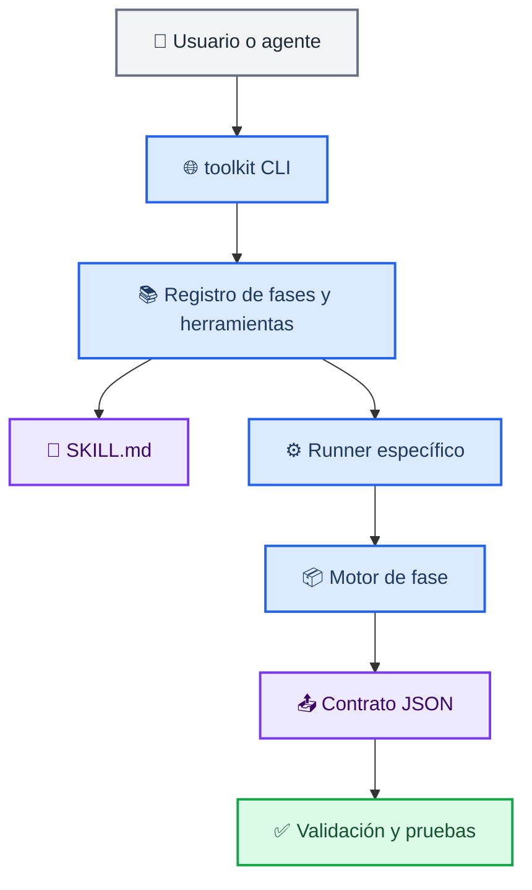

# Plan completo de implementación y corrección del Content Skills Toolkit

*Plan técnico para homogeneizar las Fases 1–6, asociar correctamente documentación y runners, ampliar el dispatcher del CLI y fortalecer la validación sin activar integraciones externas.*

---

## 📋 Resumen ejecutivo

El repositorio contiene un catálogo base de 52 skills y cinco fases especializadas con 252 runners: 57 de Datos, 89 de Programming, 23 de Automatización, 34 de Diseño y 49 de Medios. Los runners especializados tienen una estructura ejecutable consistente, pero la Fase 2 carece de `SKILL.md` por herramienta y el dispatcher general `toolkit/__main__.py` sólo resuelve actualmente herramientas ubicadas en `skills/content-toolkit/`.

La corrección recomendada debe lograr cuatro objetivos:

1. **Uniformar la documentación** de las 252 herramientas de las Fases 2–6.
2. **Asociar de forma explícita cada skill con su runner, motor, contrato y prueba.**
3. **Extender el CLI** para descubrir y ejecutar herramientas de todas las fases sin romper el comportamiento actual.
4. **Fortalecer la validación** para detectar inconsistencias entre catálogos, documentación, runners, ejemplos, esquemas y pruebas.

El plan prioriza cambios locales, reversibles y comprobables. No incluye activación automática de APIs, instalación de conectores, uso de credenciales, publicación, despliegue, commit ni push.

## 🔎 Estado actual verificado

| Área | Estado actual |
| --- | --- |
| Skills base | 52 bajo `skills/content-toolkit/` |
| Fase 2: Datos | 57 runners, sin `SKILL.md` por herramienta |
| Fase 3: Programming | 89 runners con `SKILL.md` |
| Fase 4: Automatización | 23 runners con `SKILL.md` |
| Fase 5: Diseño | 34 runners con `SKILL.md` |
| Fase 6: Medios | 49 runners con `SKILL.md` |
| Pruebas base | 13/13 exitosas |
| Pruebas Fase 2 | 57/57 exitosas |
| Pruebas Fase 3 | 89/89 exitosas |
| Pruebas Fase 4 | 23/23 exitosas |
| Pruebas Fase 5 | 34/34 exitosas |
| Pruebas Fase 6 | 49/49 exitosas |
| CLI general | Gestiona el catálogo base, no todas las fases |
| Integraciones | Diferidas y explícitas |
| Configuración Claude Code | No existe `.claude/`, `CLAUDE.md` ni `.mcp.json` |
| CI visible | No existe workflow de GitHub Actions en el árbol revisado |
| Licencia | No se encontró archivo de licencia explícito |

## 🏗️ Arquitectura objetivo

La arquitectura final debe conservar motores compartidos y runners delgados, pero añadir un registro común de fases y un contrato documental uniforme.



## 📁 Estructura objetivo del repositorio

```text
content-skills-toolkit/
├── skills/
│   └── content-toolkit/
│       └── <52 skills base>/
│           └── SKILL.md
├── toolkit/
│   ├── __init__.py
│   ├── __main__.py
│   ├── catalog.py
│   ├── integrations.py
│   ├── registry.py                         # nuevo registro unificado
│   ├── skill_engine.py                     # motor de skills base
│   ├── phase_2_engine.py
│   ├── phase_3_engine.py
│   ├── phase_4_engine.py
│   ├── phase_5_engine.py
│   └── phase_6_engine.py
│   ├── phase-2-datos/
│   │   ├── README.md
│   │   ├── catalog.json
│   │   ├── tests/
│   │   │   ├── test_phase2.py
│   │   │   └── test_documentation.py
│   │   └── <57 herramientas con contrato uniforme>/
│   ├── phase-3-programming/
│   ├── phase-4-automatizacion/
│   ├── phase-5-negocios/
│   └── phase-6-medios/
├── tests/
│   ├── test_toolkit.py
│   ├── test_runners.py
│   └── test_registry.py                  # nuevo
├── docs/
│   ├── complete-implementation-and-correction-plan.md
│   ├── phase-2-structure-normalization-plan.md
│   └── examples/
├── .github/
│   └── workflows/
│       └── validate.yml                   # opcional, segunda etapa
├── CONTRIBUTING.md
├── SECURITY.md
├── README.md
└── pyproject.toml
```

La creación de `registry.py` es recomendable, pero puede sustituirse inicialmente por funciones en `catalog.py` si se desea reducir el número de archivos. El registro no debe duplicar descripciones sin una fuente de verdad clara.

## 🧩 Contrato uniforme por herramienta

Todas las herramientas deben tener dos contratos complementarios:

| Contrato | Archivos | Propósito |
| --- | --- | --- |
| Ejecutable | `run.py`, `input.example.json`, `output.schema.json`, `tests/test_smoke.py` | Ejecutar y comprobar la salida JSON |
| Documental | `SKILL.md`, `resources/README.md`, catálogo de fase | Explicar uso, límites, entradas, salidas y guardrails |

La estructura mínima será:

```text
<fase>/<slug>/
├── SKILL.md
├── run.py
├── input.example.json
├── output.schema.json
├── resources/
│   └── README.md
└── tests/
    └── test_smoke.py
```

La excepción actual de la Fase 2 debe eliminarse mediante la creación de sus 57 `SKILL.md`. Además, la documentación de las Fases 3–6 debe auditarse y completarse donde falte o no esté correctamente asociada con su runner. El objetivo de esta fase no es asumir que los 195 documentos existentes son suficientes, sino comprobar cada herramienta y normalizar las 252 asociaciones.

## 🔧 Fases de implementación

### Fase 0: Preparación y línea base

**Objetivo:** congelar el comportamiento actual antes de modificar la estructura.

#### Tareas

1. Crear una rama de trabajo local o usar el workspace actual sin publicar cambios.
2. Registrar la revisión base:

   ```bash
   git rev-parse HEAD
   git status --short --branch
   ```

3. Ejecutar todas las pruebas actuales:

   ```bash
   python3 -m unittest discover -s tests -v
   python3 -m compileall -q toolkit skills
   python3 -m toolkit validate
   for f in toolkit/phase-*/tests/test_phase*.py; do python3 "$f"; done
   ```

4. Guardar los conteos actuales de catálogos y runners.
5. Confirmar que no se consultan integraciones durante las pruebas.

#### Criterio de salida

La línea base debe quedar documentada como verde antes de añadir documentación o modificar el dispatcher.

### Fase 1: Registro unificado de herramientas

**Objetivo:** permitir que el CLI conozca skills base y herramientas de las Fases 2–6 sin depender de rutas codificadas en varios lugares.

#### Diseño del registro

Cada entrada debe contener, como mínimo:

```python
{
    "phase": "phase-2-datos",
    "slug": "validacion-de-datos",
    "name": "Validación de datos",
    "description": "...",
    "folder": Path("toolkit/phase-2-datos/validacion-de-datos"),
    "runner": Path("toolkit/phase-2-datos/validacion-de-datos/run.py"),
    "skill_doc": Path("toolkit/phase-2-datos/validacion-de-datos/SKILL.md"),
    "engine": "phase_2_engine",
}
```

#### Reglas

- El slug debe coincidir con la carpeta.
- El runner debe existir y ser un archivo Python.
- El `SKILL.md` debe existir después de la normalización.
- El nombre y la descripción deben derivarse del catálogo o compararse con él.
- No debe cargarse ninguna integración durante el descubrimiento.
- El registro debe ser de sólo lectura.

#### Comandos CLI objetivo

Conservar los comandos existentes:

```bash
python3 -m toolkit
python3 -m toolkit list
python3 -m toolkit show <slug>
python3 -m toolkit validate
python3 -m toolkit integrations
python3 -m toolkit run <slug> -i entrada.json
```

Extenderlos para que `list`, `show` y `run` puedan resolver:

- las 52 skills base;
- las 57 herramientas de Datos;
- las 89 de Programming;
- las 23 de Automatización;
- las 34 de Diseño;
- las 49 de Medios.

Para evitar colisiones entre slugs, `list` debe mostrar la fase:

```text
phase-2-datos/validacion-de-datos    Validación de datos
phase-5-negocios/accesibilidad-web   Accesibilidad web
```

Si se conserva la invocación corta por slug, el CLI debe devolver un error claro cuando haya duplicados y ofrecer la forma cualificada por fase.

### Fase 2: Documentación de las 57 herramientas de Datos

**Objetivo:** crear o normalizar documentación autónoma y fiel al runner para las 252 herramientas especializadas.

#### Cada `SKILL.md` debe contener

1. Frontmatter con `name` y `description`.
2. Un único H1 con el nombre de la herramienta.
3. Propósito.
4. Runner asociado.
5. Flujo de trabajo.
6. Entradas aceptadas.
7. Salida esperada.
8. Guardrails.
9. Plantilla de solicitud.
10. Lista de control.
11. Límites de implementación.

#### Regla de fidelidad

La documentación debe describir lo que el runner hace actualmente, no lo que el nombre de la herramienta podría sugerir.

Ejemplos:

- Una herramienta financiera puede producir un marco de análisis, pero no debe presentarse como una fuente de precios actualizados si no consulta APIs.
- Una herramienta de dashboards puede producir HTML local, pero no debe describirse como un dashboard desplegado.
- Una herramienta SQL puede proponer una revisión, pero no debe afirmar que ejecutó `EXPLAIN`.
- Una herramienta de búsqueda puede preparar una consulta, pero no debe afirmar que descargó datos externos.

#### Asociación obligatoria

Cada documento debe incluir una sección equivalente a:

```text
Runner específico: toolkit/<fase>/<slug>/run.py
Motor: toolkit/<motor_de_fase>.py
Adaptador: función o rama del motor asociada a <slug>
Entrada: toolkit/<fase>/<slug>/input.example.json
Salida: toolkit/<fase>/<slug>/output.schema.json
Prueba: toolkit/<fase>/<slug>/tests/test_smoke.py
```

La documentación debe cubrir las 57 herramientas de Datos, 89 de Programming, 23 de Automatización, 34 de Diseño y 49 de Medios. Para las 195 herramientas que ya tienen `SKILL.md`, la tarea será auditar y corregir la asociación; no se deben sobrescribir a ciegas.

### Fase 3: Validación documental y de contratos

**Objetivo:** convertir las convenciones en comprobaciones automáticas.

#### Extender `toolkit/catalog.py`

Añadir validaciones para:

- frontmatter presente;
- `name` no vacío;
- `description` no vacía;
- coincidencia entre nombre y catálogo;
- secciones obligatorias;
- un único H1;
- ausencia de métricas de popularidad;
- ausencia de credenciales y secretos;
- referencia al runner correcto;
- referencia al motor correcto;
- existencia de ejemplo, esquema y smoke test.

#### Separar niveles de validación

```text
validate_catalog()
├── validate_base_skills()
├── validate_phase_contracts()
├── validate_skill_documents()
├── validate_catalog_runner_alignment()
└── validate_output_contracts()
```

La validación debe informar el archivo y la regla incumplida, por ejemplo:

```text
phase-2-datos/validacion-de-datos:
- falta la sección ## Guardrails
- description no coincide con catalog.json
- runner declarado no existe
```

### Fase 4: Pruebas y cobertura

**Objetivo:** evitar regresiones funcionales y documentales.

#### Nuevas pruebas

Crear o ampliar:

```text
tests/test_registry.py
toolkit/phase-2-datos/tests/test_documentation.py
toolkit/phase-3-programming/tests/test_documentation.py
toolkit/phase-4-automatizacion/tests/test_documentation.py
toolkit/phase-5-negocios/tests/test_documentation.py
toolkit/phase-6-medios/tests/test_documentation.py
```

#### Casos mínimos

- El registro encuentra las 52 skills base y las 252 herramientas especializadas.
- `list` muestra fase y slug.
- `show` imprime el `SKILL.md` correcto.
- `run` ejecuta una herramienta base.
- `run` ejecuta `validacion-de-datos` de Fase 2.
- `run` rechaza un slug inexistente.
- Un slug duplicado exige nombre cualificado.
- Una carpeta sin runner produce error de validación.
- Una descripción desincronizada produce error de validación.
- Un `SKILL.md` sin sección obligatoria produce error de validación.
- Las integraciones no se cargan durante `list`, `show` ni `validate`.
- Los 57 runners de Fase 2 siguen devolviendo `ready` con sus ejemplos.

#### Pruebas de no regresión

Las pruebas existentes deben conservarse sin reducir su cobertura:

```bash
python3 -m unittest discover -s tests -v
python3 toolkit/phase-2-datos/tests/test_phase2.py
python3 toolkit/phase-3-programming/tests/test_phase3.py
python3 toolkit/phase-4-automatizacion/tests/test_phase4.py
python3 toolkit/phase-5-negocios/tests/test_phase5.py
python3 toolkit/phase-6-medios/tests/test_phase6.py
```

### Fase 5: Corrección del dispatcher CLI

**Objetivo:** que el comando general del repositorio pueda asociar una skill con su runner real.

#### Comportamiento esperado de `show`

```bash
python3 -m toolkit show phase-2-datos/validacion-de-datos
```

Debe mostrar el `SKILL.md` correspondiente.

También puede aceptar:

```bash
python3 -m toolkit show validacion-de-datos
```

si no existe una colisión.

#### Comportamiento esperado de `run`

```bash
python3 -m toolkit run phase-2-datos/validacion-de-datos \
  -i toolkit/phase-2-datos/validacion-de-datos/input.example.json
```

El CLI debe:

1. resolver la entrada en el registro;
2. comprobar que el runner existe;
3. invocarlo con el mismo intérprete Python;
4. propagar su código de salida;
5. no alterar el JSON producido;
6. no cargar integraciones salvo que el payload las solicite explícitamente.

#### Compatibilidad

No debe romperse esta ruta existente:

```bash
python3 -m toolkit run estratega-de-seo-y-aeo \
  -i skills/content-toolkit/estratega-de-seo-y-aeo/input.example.json
```

### Fase 6: Documentación de fase y README raíz

Actualizar `toolkit/phase-2-datos/README.md` con:

- estructura de cada herramienta;
- relación entre `SKILL.md`, runner y motor;
- reglas de entrada y salida;
- lista de integraciones diferidas;
- comandos de validación;
- tratamiento de herramientas que sólo generan planes o plantillas.

Actualizar `README.md` para separar claramente:

```text
skills/content-toolkit/       # 52 skills base

toolkit/phase-2-datos/        # 57 herramientas de Datos
toolkit/phase-3-programming/  # 89 herramientas
toolkit/phase-4-automatizacion/ # 23 herramientas
toolkit/phase-5-negocios/     # 34 herramientas
toolkit/phase-6-medios/       # 49 herramientas
```

También debe documentarse la ruta de ejecución completa:

```text
CLI → registro → SKILL.md → runner → motor de fase → JSON → pruebas
```

### Fase 7: Automatización de calidad

**Objetivo:** ejecutar las comprobaciones automáticamente sin activar servicios externos.

#### Workflow recomendado

Crear `.github/workflows/validate.yml` con pasos equivalentes a:

```yaml
- name: Run unit tests
  run: python3 -m unittest discover -s tests -v

- name: Compile Python
  run: python3 -m compileall -q toolkit skills

- name: Validate catalog and contracts
  run: python3 -m toolkit validate

- name: Validate phase runners
  run: |
    python3 toolkit/phase-2-datos/tests/test_phase2.py
    python3 toolkit/phase-3-programming/tests/test_phase3.py
    python3 toolkit/phase-4-automatizacion/tests/test_phase4.py
    python3 toolkit/phase-5-negocios/tests/test_phase5.py
    python3 toolkit/phase-6-medios/tests/test_phase6.py
```

El workflow no debe:

- cargar secretos;
- consultar APIs;
- publicar resultados;
- ejecutar despliegues;
- modificar el repositorio;
- activar integraciones de forma implícita.

### Fase 8: Configuración opcional de Claude Code

Esta fase es posterior y no debe bloquear la normalización del código.

#### Skill de validación

Propuesta:

```text
.claude/skills/validate-content-toolkit/SKILL.md
```

Debe revisar únicamente:

- archivos modificados;
- contratos de herramientas afectadas;
- pruebas relacionadas;
- consistencia de metadatos;
- límites y guardrails.

Debe ser de sólo revisión y no ejecutar commit, push, publicación ni llamadas externas.

#### Subagente de guardrails

Propuesta:

```text
.claude/agents/content-safety-reviewer.md
```

Debe detectar:

- claims no demostrados;
- credenciales expuestas;
- promesas de ejecución externa;
- incoherencias entre documentación y runner;
- pérdida de trazabilidad.

No debe modificar archivos automáticamente.

## 🛡️ Reglas de seguridad y límites

Todas las fases deben conservar estas reglas:

1. No cargar integraciones durante descubrimiento, listado o validación.
2. No incluir credenciales, tokens o secretos en documentación, ejemplos o tests.
3. No ejecutar servicios externos sin solicitud explícita y configuración autorizada.
4. No afirmar que se produjo un archivo binario, render, publicación o consulta si no existe evidencia.
5. No evadir autenticación, CAPTCHA, robots, límites, permisos o controles anti-bot.
6. No convertir plantillas en supuestos resultados reales.
7. No ejecutar comandos destructivos desde runners ni hooks.
8. Mantener salidas reproducibles y registrar supuestos.
9. Mantener las modificaciones de la normalización separadas de cambios funcionales de cada dominio.

## 🔄 Orden recomendado de implementación

| Orden | Entregable | Dependencias | Riesgo |
| ---: | --- | --- | --- |
| 1 | Línea base y conteos | Ninguna | Bajo |
| 2 | `SKILL.md` de Fase 2 | Catálogos existentes | Bajo |
| 3 | Validador documental | `SKILL.md` disponibles | Medio |
| 4 | Registro unificado | Validador y runners | Medio |
| 5 | CLI para fases | Registro unificado | Medio |
| 6 | Pruebas de registro y CLI | CLI implementado | Bajo |
| 7 | README y documentación de fase | Estructura final | Bajo |
| 8 | CI | Todas las pruebas verdes | Bajo |
| 9 | Skill/subagente de Claude Code | Flujo estable | Bajo |

## 🧪 Matriz de validación final

| Comprobación | Criterio de aceptación |
| --- | --- |
| Skills base | 52 válidas |
| Documentación Fase 2 | 57 `SKILL.md` válidos |
| Runners Fase 2 | 57/57 con salida `ready` |
| Runners Fase 3 | 89/89 con salida `ready` |
| Runners Fase 4 | 23/23 con salida `ready` |
| Runners Fase 5 | 34/34 con salida `ready` |
| Runners Fase 6 | 49/49 con salida `ready` |
| Registro | 304 entradas totales: 52 base + 252 especializadas |
| CLI `list` | Muestra fase y slug sin colisiones ambiguas |
| CLI `show` | Abre la documentación correcta |
| CLI `run` | Ejecuta base y fases especializadas |
| Integraciones | No se cargan implícitamente |
| Compilación | Sin errores en `toolkit` ni `skills` |
| Estilo | `git diff --check` sin errores |
| Seguridad | Sin credenciales ni archivos sensibles nuevos |
| Remoto | Sin commit ni push durante la preparación |

## ✅ Criterios de aceptación detallados

La implementación se considerará completa cuando:

- las 252 herramientas de las Fases 2–6 tengan un `SKILL.md` válido;
- cada documento describa el runner real, el motor y los límites reales;
- `catalog.json`, frontmatter, carpeta y runner estén alineados;
- el validador detecte errores de estructura y metadatos;
- el CLI pueda listar, mostrar y ejecutar herramientas de todas las fases;
- los slugs duplicados se resuelvan mediante nombres cualificados;
- las pruebas actuales sigan pasando;
- existan pruebas específicas para el registro y el dispatcher;
- las integraciones continúen siendo diferidas;
- la documentación del README no contradiga la estructura real;
- el workflow de CI ejecute sólo validaciones locales;
- no se creen commits ni se haga push sin una instrucción posterior explícita.

## ⚠️ Riesgos y mitigaciones

| Riesgo | Impacto | Mitigación |
| --- | --- | --- |
| Desincronización entre catálogo y `SKILL.md` | Alto | Validador de nombres y descripciones |
| Colisión de slugs | Medio | Identificador cualificado por fase |
| Regresión del CLI base | Alto | Pruebas de compatibilidad antes y después |
| Documentación que promete demasiado | Alto | Revisión contra cada `run.py` y motor |
| Ejecución externa accidental | Alto | Tests sin integraciones y guardrails explícitos |
| Generación masiva de documentos incorrectos | Medio | Generación inicial seguida de revisión por categorías |
| CI excesivamente pesada | Medio | Usar Python estándar y limitar pruebas a contratos locales |
| Duplicación de metadatos | Medio | Definir catálogo como fuente de identidad y validar sincronización |

## 📦 Entregables finales

La implementación completa debe producir, como mínimo:

```text
57 archivos `SKILL.md` nuevos en `phase-2-datos/` y auditoría de los 195 existentes en Fases 3–6
1 validador documental ampliado
1 registro unificado o equivalente
1 extensión del CLI para las Fases 2–6
1 prueba del registro
1 prueba documental de Fase 2
1 actualización del README de Fase 2
1 actualización del README raíz
1 workflow de validación local, si se aprueba CI
```

## 🚫 Fuera de alcance

No forman parte de este plan:

- conectar APIs financieras, científicas, multimedia o cloud;
- instalar MCP servers;
- configurar credenciales reales;
- generar archivos binarios de video, audio o imagen;
- desplegar dashboards o aplicaciones;
- publicar releases o anuncios;
- cambiar la licencia del repositorio;
- cambiar los nombres de las fases;
- convertir cada runner en una dependencia independiente;
- hacer commit o push.

## 🏁 Procedimiento de cierre

Cuando los entregables estén implementados y las pruebas estén verdes:

1. Ejecutar la matriz completa de validación.
2. Revisar `git diff --check`.
3. Confirmar que sólo existen los archivos esperados.
4. Confirmar que `HEAD` no se ha publicado.
5. Presentar los cambios locales y sus resultados.
6. Mantener la rama como está hasta recibir una decisión explícita de integración.

La implementación debe finalizar con un estado local reproducible y verificable, no con una publicación automática.
